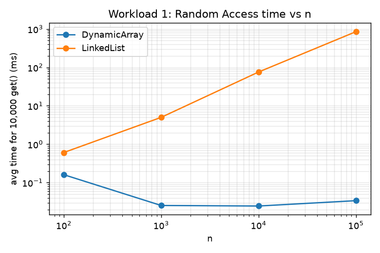
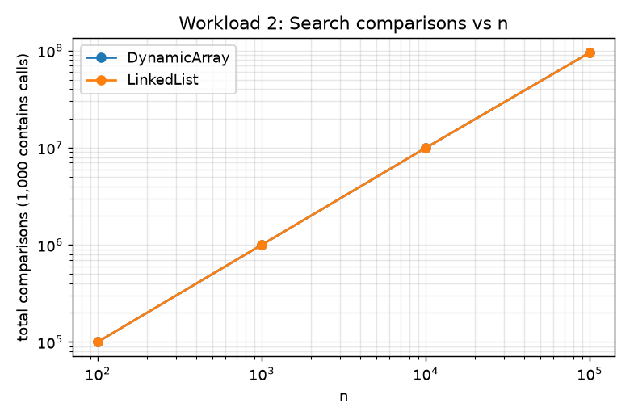
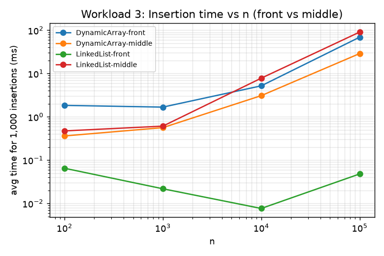
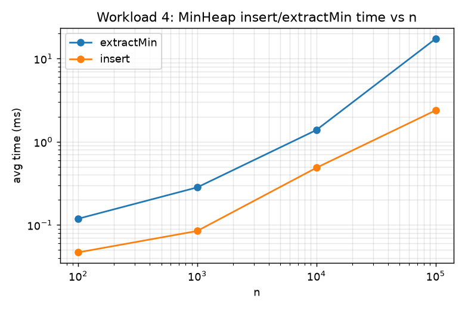

# Assignment 2 — Dynamic Array, Linked List, Min-Heap: Analysis and Benchmarks

## 1. Overview

This repository implements three data structures from scratch — a resizable
`DynamicArray`, a singly-linked `MyLinkedList`, and an array-based `MinHeap`
— and compares them under four controlled workloads (random access, search,
insertion/removal, priority processing). The goal isn't just to make the
structures work, but to check whether their measured behaviour actually
matches what the asymptotic analysis predicts, and to explain the cases
where it doesn't.

Source files:
- `src/DynamicArray.java`
- `src/MyLinkedList.java`
- `src/MinHeap.java`
- `src/Benchmark.java` — runs all four workloads, prints CSV to stdout
- `src/Tests.java` — correctness tests, run with `java Tests`

## 2. Complexity Analysis

### 2.1 Dynamic Array

| Operation      | Best   | Average | Worst  | Aux. space | Notes |
|----------------|--------|---------|--------|------------|-------|
| `add(x)`       | Θ(1)   | Θ(1)*   | Θ(n)   | Θ(1) amort.| Worst case only when the backing array is full and must be doubled. |
| `add(index,x)` | Θ(1)   | Θ(n)    | Θ(n)   | Θ(1)       | Best case is `index == size`. Otherwise every element after `index` shifts right. |
| `remove(index)`| Θ(1)   | Θ(n)    | Θ(n)   | Θ(1)       | Best case is removing the last element. |
| `get(index)`   | Θ(1)   | Θ(1)    | Θ(1)   | Θ(1)       | Direct index into contiguous memory, no case distinction. |
| `contains(x)`  | Ω(1)   | Θ(n)    | O(n)   | Θ(1)       | Best case: the element is at index 0. Worst case: absent, or at the last index. |

\* `add(x)` is Θ(1) amortized: doubling happens O(log n) times over n insertions,
so the total work for n appends is Θ(n), i.e. Θ(1) per call on average.

### 2.2 Linked List (singly-linked, with tail pointer)

| Operation      | Best   | Average | Worst  | Aux. space | Notes |
|----------------|--------|---------|--------|------------|-------|
| `add(x)`       | Θ(1)   | Θ(1)    | Θ(1)   | Θ(1)       | Tail pointer makes append O(1); no shifting, unlike the array. |
| `add(index,x)` | Θ(1)   | Θ(n)    | Θ(n)   | Θ(1)       | Best case is index 0. Otherwise the list must be walked from head. |
| `remove(index)`| Θ(1)   | Θ(n)    | Θ(n)   | Θ(1)       | Best case is index 0 (no traversal). |
| `get(index)`   | Θ(1)   | Θ(n)    | Θ(n)   | Θ(1)       | No random access — always walked from head. |
| `contains(x)`  | Ω(1)   | Θ(n)    | O(n)   | Θ(1)       | Same shape as array search, but with worse constants (pointer chasing). |

### 2.3 Min-Heap (binary, array-based)

| Operation      | Best   | Average    | Worst      | Aux. space | Notes |
|----------------|--------|------------|------------|------------|-------|
| `insert(x)`    | Θ(1)   | Θ(log n)   | Θ(log n)   | Θ(1) amort.| Best case: new element already satisfies heap order at its leaf position, sift-up stops immediately. |
| `peekMin()`    | Θ(1)   | Θ(1)       | Θ(1)       | Θ(1)       | Root is always the minimum, no traversal needed. |
| `extractMin()` | Θ(log n)| Θ(log n)  | Θ(log n)   | Θ(1)       | Moving the last element to the root and sifting down always costs up to the tree height, even in the "best" case, because the property must be re-checked level by level. |

### 2.4 Operations that look similar but aren't

`get(index)` on the array and on the list have identical names and
signatures but completely different complexity classes — Θ(1) vs Θ(n) —
because the array supports random memory access while the list requires
pointer-chasing from the head.

Similarly, `add(index, x)` at the front (`index = 0`) is Θ(1) for the linked
list but Θ(n) for the array (everything shifts right), while at the back
(`index = size`) it's the reverse story in spirit — Θ(1) amortized for the
array's `add(x)`, and also Θ(1) for the list because of the tail pointer.
The *position* of the operation, not just its name, determines the cost.

`insert(x)` on the heap and `add(x)` on the array are both "add an
element", both amortized close to constant/logarithmic, but they optimize
for different things: the array only guarantees order is whatever you put
in; the heap actively maintains partial order, which is why it costs
Θ(log n) even in the best case for `insert` reaching a non-trivial depth,
versus the array's true Θ(1).

## 3. Correctness — Loop Invariant Proofs

### 3.1 `DynamicArray.remove(index)`

```java
for (int i = index; i < size - 1; i++) {
    data[i] = data[i + 1];
}
```

**Loop invariant:** At the start of each iteration of the loop (for the
current value of `i`), the subarray `data[index .. i-1]` holds exactly the
elements that were originally at positions `index+1 .. i` before the loop
began — i.e., every slot from `index` up to (but not including) `i` has
already been shifted one position to the left, and the elements from
position `i` onward are still in their original places.

- **Initialization:** Before the first iteration, `i = index`. The range
  `data[index .. i-1]` is empty (since `i - 1 = index - 1 < index`), so the
  invariant holds vacuously — nothing has been shifted yet, which matches
  reality.

- **Maintenance:** Assume the invariant holds at the start of an iteration
  with some value of `i` (so `data[index .. i-1]` already contains the
  shifted elements from `index+1 .. i`). The loop body executes
  `data[i] = data[i + 1]`, which copies the still-untouched original
  element at position `i+1` into position `i`. After this, `data[index .. i]`
  now correctly holds the elements originally at `index+1 .. i+1`. Then `i`
  is incremented. The invariant — restated for the new value of `i` — holds
  again.

- **Termination:** The loop stops when `i = size - 1`, i.e. after the
  iteration where `i = size - 2` executed. At that point, by the invariant,
  `data[index .. size - 2]` contains exactly the elements originally at
  `index+1 .. size-1`. This is precisely every element that came after the
  removed one, now shifted one slot left; slot `size - 1` (the old last
  element's duplicate) is cleared separately right after the loop.

- **Why this proves correctness:** The postcondition we want for `remove`
  is "the array with the element at `index` deleted, and every subsequent
  element shifted left by one, with no gaps." The invariant at termination
  states exactly this for the range `index .. size-2`, which after
  decrementing `size` becomes the new valid contents of the array. Since the
  invariant was shown to hold at initialization and to be preserved by every
  iteration, and its terminating form matches the required postcondition,
  the shifting loop is correct.

### 3.2 `MinHeap.extractMin()` — the sift-down loop

```java
while (true) {
    int l = left(i);
    int r = right(i);
    int smallest = i;
    if (l < size && at(l).compareTo(at(smallest)) < 0) smallest = l;
    if (r < size && at(r).compareTo(at(smallest)) < 0) smallest = r;
    if (smallest == i) break;
    swap(i, smallest);
    i = smallest;
}
```

This loop runs after the last element has been moved to the root (position
0) and the old root has been returned as the minimum.

**Loop invariant:** At the start of each iteration, the binary tree rooted
at index `i` is the *only* part of the array that may violate the min-heap
property (every node's key ≤ its children's keys); every subtree rooted
anywhere else in the array already satisfies the min-heap property.

- **Initialization:** Before the loop starts, `i = 0`. Moving an arbitrary
  element to the root is the only change made to the array; both original
  child subtrees of the root were valid heaps before the extraction (given
  as the heap-property precondition) and are untouched by this move. So the
  only place a violation can exist is at the root itself — which matches
  the invariant with `i = 0`.

- **Maintenance:** Assume the invariant holds for the current `i`: the
  subtree rooted at `i` may be invalid, but its children's subtrees (rooted
  at `left(i)` and `right(i)`) are already valid heaps. The loop body finds
  `smallest`, the index holding the minimum key among `data[i]` and its
  (up to two) children — this is a correct choice because those are the
  only three candidates for the minimum of the subtree, since the
  children's own subtrees are already valid heaps and therefore have their
  own minimum at their own root. If `smallest == i`, the node at `i` is
  already ≤ both children, so the whole subtree at `i` is valid and the
  loop halts — consistent with the invariant, since no part of the array
  violates the property anymore. Otherwise, swapping `data[i]` with
  `data[smallest]` places the smaller key at position `i` (fixing that
  local violation) and pushes the previously-misplaced element down into
  position `smallest`. Every other part of the tree is unaffected. Setting
  `i = smallest` re-establishes the invariant for the new iteration: the
  only place that might still be invalid is the subtree now rooted at the
  new `i`.

- **Termination:** The loop terminates either when `smallest == i` (no
  swap needed) or when `i` reaches a leaf (both `left(i)` and `right(i)`
  are `>= size`, so `smallest` can never be reassigned). Since `i` strictly
  increases in tree depth on every iteration (it moves to a child) and the
  tree has finite height ⌊log₂ size⌋, the loop must terminate within
  O(log n) iterations.

- **Why this proves correctness:** At termination, the invariant says the
  subtree rooted at the final value of `i` is the only possible source of
  violation — but the loop only exits when that subtree is *also* valid
  (either because `smallest == i` was already true, or because `i` is a
  leaf with no children to violate anything). So at termination, no subtree
  anywhere in the array violates the min-heap property, which is exactly
  the postcondition `extractMin()` must guarantee before returning.

## 4. Experimental Setup

- **n** (initial size): 100, 1,000, 10,000, 100,000 — same set for every workload.
- **m** (operations per workload): 10,000 gets (Workload 1), 1,000 searches
  (Workload 2), 1,000 insertions + 1,000 removals at two positions (Workload 3),
  n inserts + n extracts (Workload 4).
- **Repetitions:** every timed section is run 5 times; the reported time is
  the arithmetic mean.
- **Timing:** `System.nanoTime()`, wrapping only the operation loop — input
  generation (`randomInts`, `randomIndices`) happens before the timer starts.
- **Random seed:** `new Random(42)` for the base data, and separate fixed
  seeds for query/index generation, so every run of `Benchmark.java`
  reproduces the same numbers in `results/tables/raw_results.csv`.
- **Metrics:** in addition to time, each workload counts something
  structural — element accesses (Workload 1), comparisons (Workload 2),
  element movements (Workload 3), and comparisons plus an explicit
  non-decreasing check (Workload 4).

Run it yourself with (PowerShell):
```powershell
cd src
javac *.java
java Tests
java Benchmark | Out-File -Encoding utf8 ..\results\tables\raw_results.csv
cd ..
python plot.py
```

## 5. Results

Raw data: `results/tables/raw_results.csv`. Plots: `results/plots/`.

### Workload 1 — Random Access (time, ms, for 10,000 `get()` calls)

| n       | DynamicArray | LinkedList |
|---------|--------------|------------|
| 100     | 0.161        | 0.608      |
| 1,000   | 0.025        | 5.007      |
| 10,000  | 0.025        | 75.789     |
| 100,000 | 0.034        | 850.896    |



### Workload 2 — Search (time, ms, for 1,000 `contains()` calls; comparisons)

| n       | DynamicArray time | LinkedList time | Comparisons (both, same target values) |
|---------|--------------------|--------------------|------------------------------------------|
| 100     | 0.497              | 0.456              | 100,000    |
| 1,000   | 1.707              | 1.837              | 999,496    |
| 10,000  | 5.748              | 20.895             | 9,950,295  |
| 100,000 | 48.864             | 214.093            | 95,206,221 |



### Workload 3 — Insertion at front vs. middle (time, ms, for 1,000 ops)

| n       | Array-front insert | List-front insert | Array-mid insert | List-mid insert |
|---------|---------------------|---------------------|--------------------|--------------------|
| 100     | 1.838               | 0.065               | 0.361              | 0.472              |
| 1,000   | 1.676               | 0.022               | 0.562              | 0.609              |
| 10,000  | 5.199               | 0.008               | 3.084              | 7.814              |
| 100,000 | 69.230              | 0.048               | 28.983             | 90.886             |

(Removal follows the same shape — see the CSV for the full front/middle
insert/remove matrix.)



### Workload 4 — Priority Processing (MinHeap, time in ms)

| n       | insert (n ops) | extractMin (n ops) | comparisons |
|---------|----------------|----------------------|-------------|
| 100     | 0.047          | 0.119                | 1,035       |
| 1,000   | 0.085          | 0.283                | 17,226      |
| 10,000  | 0.487          | 1.385                | 239,329     |
| 100,000 | 2.384          | 17.292               | 3,059,125   |

Every run confirmed `extractMin()` returns elements in non-decreasing order
(the `non_decreasing` column is 1 for all n).



## 6. Discussion

**Workload 1** matches theory cleanly: `DynamicArray.get()` stays flat
(Θ(1)) across four orders of magnitude of n — even dropping slightly
between n=100 and n=1,000 due to JIT warm-up rather than any real
complexity effect — while `LinkedList.get()` grows essentially linearly
with n. At n=100,000 the list is roughly 25,000× slower than the array for
the same 10,000 lookups, because each `get(index)` walks on average n/2
nodes.

**Workload 2** also agrees with theory in shape (both are Θ(n) per
`contains` call, so total time grows linearly with n) but the *constant
factor* differs: the array is consistently faster than the list at the same
n, even though both perform the identical number of comparisons (confirmed
by the matching `comparisons` column). This is a direct illustration of
question 4/5 in the assignment — identical asymptotic complexity, different
real time — because array traversal walks contiguous memory (cache-friendly)
while list traversal chases pointers scattered across the heap. At n=10,000
the gap is already ~3.6×, and it widens further at n=100,000.

**Workload 3** is the most illustrative one: `insert`/`remove` at the
*front* is cheap for the list (Θ(1), no shifting — times stay under
0.05 ms even at n=100,000) and expensive for the array (Θ(n), everything
shifts — up to 69 ms at n=100,000). In the *middle*, the array is still
faster than the list in every measured case, because although both cost
Θ(n) in theory, the list's Θ(n) is a genuine full pointer traversal on top
of the pointer manipulation, while the array's Θ(n) is a tight,
cache-friendly shift over contiguous memory — again a constant-factor
story, not a complexity-class one.

**Workload 4** matches theory: both `insert` and `extractMin` grow much
more slowly than the Θ(n) list/array operations — insert time only goes
from 0.047 ms to 2.384 ms (about 50×) as n goes from 100 to 100,000
(1,000×), consistent with the log n factor. The comparison count also
tracks n log n closely (3,059,125 comparisons at n=100,000 is on the same
order as n·log₂n ≈ 1.66M, scaled by the constant ~2 comparisons per level
in sift-down/sift-up).

**Where results deviate slightly from theory:** at very small n (100,
1,000) JVM warm-up dominates measured time, so times don't scale as
cleanly as the asymptotic formulas suggest (e.g. Workload 1's array time
barely changes between n=1,000 and n=10,000, both sitting near the
resolution floor of a sub-millisecond operation). This is expected:
asymptotic analysis describes trends for large n, not micro-level timing at
small n where constant overheads dominate.

## 7. Design Recommendations

- **Prefer the Dynamic Array** for workloads dominated by random access
  (`get`) or search by value where cache locality matters, and for
  insertions/removals concentrated at the end.
- **Prefer the Linked List** when insertions/removals happen mostly at the
  front (or via an already-held reference/iterator to a node), and total
  size is unpredictable or resizing large contiguous blocks is undesirable.
- **The Min-Heap** is the right structure whenever the workload is
  "always give me the current minimum/maximum next" — its Θ(log n)
  insert/extract with Θ(1) peek beats keeping a sorted array (Θ(n) insert)
  or an unsorted array (Θ(n) extract) for any workload that interleaves
  inserts and extracts.
- In general, the workload's *access pattern* — not just its size — should
  drive the choice: the same n elements can favor either structure
  depending on whether the dominant operation is indexed lookup, front
  modification, or priority retrieval.

## 8. Conclusion

Across all four workloads, the measured results confirm the theoretical
complexity classes derived in Section 2: Θ(1) array access beats Θ(n) list
traversal by orders of magnitude as n grows; front-insertion flips that
advantage to the list; and the heap's Θ(log n) operations scale far better
than any Θ(n) alternative for repeated minimum extraction. The main lesson
beyond Big-O is that two operations in the same complexity class can still
differ substantially in real time because of constant factors — memory
layout and pointer-chasing overhead in this case — which is exactly why the
assignment asks for both theoretical and empirical analysis rather than
either alone.